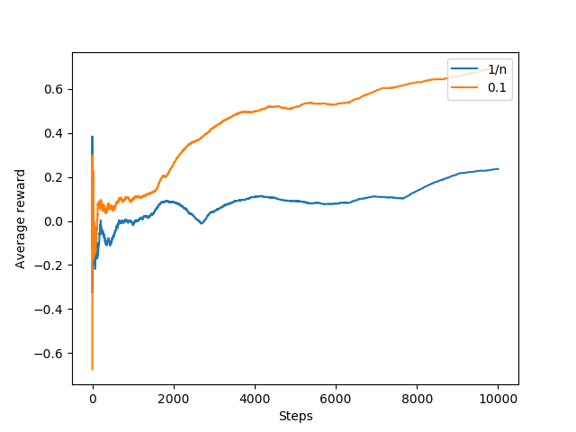
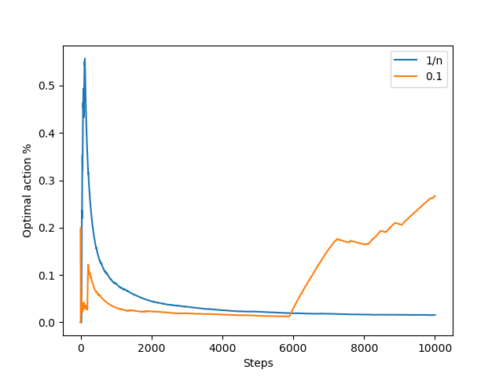
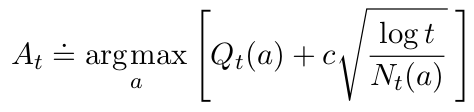
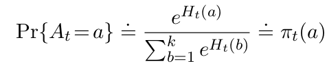
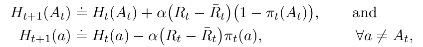
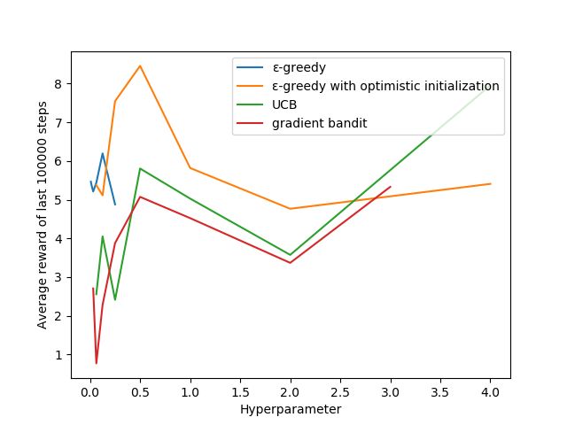

Bandit problems
===
`simple.py`
---
`simple.py` contains a basic k-armed bandit problem algorithm using ε-greedy action selection and sample-average estimations.
An agent selects one of `k` actions, which results in a reward. The true rewards of the actions - values - are unknown
to the agent. The values are generated according to a unit gaussian distribution. The agent aims to maximize its reward
by updating its estimates of the action values. In each step, the agent exploits its current estimates with a
probability of `1 - ε` to get the highest reward. With a probability of `ε` it explores a new action by sampling a
random action which has suboptimal estimates.
### Hyperparameters:
Parameter | Value | Explanation
--- | ---: | ---
k | 10 | The amount of 'arms', i.e. the amount of possible actions to take
alpha | 1 / n | The step size, which controls the magnitude of estimate updates. `n` refers to the amount an action was taken up until the estimation update.
epsilon | 0.1 | The probability of exploring non-greedy actions
steps | 1000 | The amount of training iterations

`2.5.py`
---
`2.5.py` compares the performance of the ε-greedy algorithm on stationary and non-stationary tasks.
In a non-stationary task, the values of actions are changing over time. In this implementation, every action value
starts out equal (as a random number drawn from unit gaussian distribution). Then, in each training step, the value
of each action is updated by adding a random number drawn from a gaussian distribution with a mean of 0 and a standard
deviation of 0.01.
### Result
After training, a plot shows the performance of a sample-average and a constant-step-size algorithm. It is clear to see
that the constant-step-size algorithm performs better on non-stationary tasks.

### Hyperparameters
#### Sample-average
Parameter | Value | Explanation
--- | ---: | ---
k | 10 | The amount of 'arms', i.e. the amount of possible actions to take
alpha | 1 / n | The step size, which controls the magnitude of estimate updates. `n` refers to the amount an action was taken up until the estimation update.
epsilon | 0.1 | The probability of exploring non-greedy actions
steps | 10000 | The amount of training iterations
#### Constant-step-size
Parameter | Value | Explanation
--- | ---: | ---
k | 10 | The amount of 'arms', i.e. the amount of possible actions to take
alpha | 0.1 | The step size, which controls the magnitude of estimate updates.
epsilon | 0.1 | The probability of exploring non-greedy actions
steps | 1000 | The amount of training iterations

`2.8.py`
---
`2.8.py` compares the performance of different algorithms on a non-stationary k-armed-bandit problem. Following
algorithms are included:
* ε-greedy
* ε-greedy with optimistic initialization
* upper confidence bound
* gradient bandit
### Optimistic initialization
Optimistic initialization is very similar to the ε-greedy algorithm. Contrary to the ε-greedy algorithm, it does not
initialize the value estimates with 0, but with a positive number. The agent will now choose greedy actions based on
their high estimates, but will be 'disappointed' of their small rewards. Greedy actions will effectively become
exploratory actions. That way, optimistic initialization increases the exploration rate. However, this effect wears
down after the initial training steps. Optimistic initialization is considered to be a suboptimal way to promote
exploration.

### Upper Confidence Bound
The upper confidence bound chooses its actions differently from the ε-greedy. Instead of randomly deciding between
explorative and exploitative actions, this algorithm introduces an upper confidence bound by which actions are selected.

Where `Q_t(a)` is the current value estimate of action `a`, `c` is a hyperparameter that controls the degree of
exploration, `t` is the current time step and `N_t(a)` is the amount of times action `a` has been selected.

Intuitively, the upper confidence bound increases as other actions are chosen, making this action more likely to be
chosen next time.

UCB is nice for the bandit problem but does not scale to general reinforcement learning tasks.

### Gradient bandit
The gradient bandit drops action value estimates as used in other algorithms. Instead, it uses a _numerical preference_
of choosing an action. This number has no other interpretation except showing that actions with higher preferences
result in higher rewards than actions with lower preferences. These preferences are viewed as unnormalized log
probabilities and are converted to probabilities using the softmax equation:

Where `H_t(a)` is the current preference of action `a`. The action with the highest probability is chosen. After
receiving the reward `R_t`, the preferences for each actions are updated according to the following gradient equation:

where α is the step-size parameter and `R_t bar` is the average reward.

### Result
The training is conducted for 200,000 steps. The average reward of the last 100,000 steps is used as measure for
comparison. After training, a plot similar to the one below is created. It shows the average reward of the last 100,000
steps for each important hyperparameter setting of each algorithms. The important hyperparameters used in the plot are:
* ε for ε-greedy
* initial estimates for ε-greedy with optimistic initialization
* c for upper confidence bound
* α for gradient bandit

### Hyperparameters
#### ε-greedy
Parameter | Value | Explanation
--- | ---: | ---
epsilon | one of 1/128, 1/64, 1/32, 1/16, 1/8, 1/4 | The probability of exploring non-greedy actions
k | 10 | The amount of 'arms', i.e. the amount of possible actions to take
alpha | 0.1 | The step size, which controls the magnitude of estimate updates.
steps | 200000 | The amount of training iterations
#### Optimistic initialization
Parameter | Value | Explanation
--- | ---: | ---
initial estimates | one of 1/16, 1/8, 1/4, 1/2, 1, 2, 4 | Number used as the initial value estimate (instead of 0)
k | 10 | The amount of 'arms', i.e. the amount of possible actions to take
alpha | 0.1 | The step size, which controls the magnitude of estimate updates.
epsilon | 0.1 | The probability of exploring non-greedy actions
steps | 200000 | The amount of training iterations
#### Upper Confidence Bound
Parameter | Value | Explanation
--- | ---: | ---
c | one of 1/16, 1/8, 1/4, 1/2, 1, 2, 4 | The degree of exploration
k | 10 | The amount of 'arms', i.e. the amount of possible actions to take
alpha | 0.1 | The step size, which controls the magnitude of estimate updates.
steps | 200000 | The amount of training iterations
#### Gradient bandit
Parameter | Value | Explanation
--- | ---: | ---
alpha | one of 1/32, 1/16, 1/8, 1/4, 1/2, 1, 2, 3 | The step size, which controls the magnitude of preference gradients.
k | 10 | The amount of 'arms', i.e. the amount of possible actions to take
steps | 200000 | The amount of training iterations
